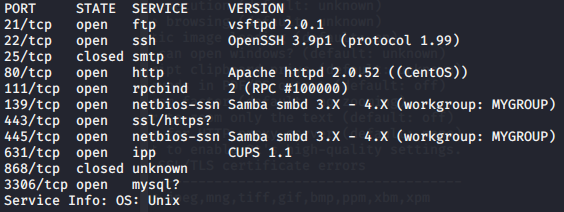
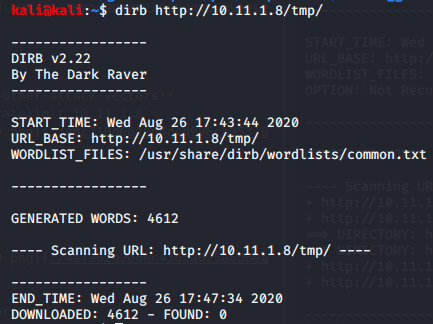
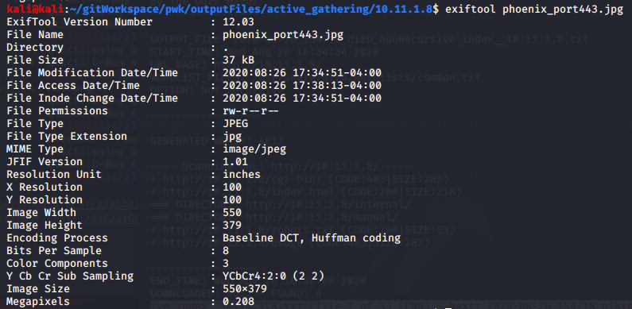

Enumeration

Enumeration

# NMAP
## TCP Ports
TCP Connect scan with service detection
`sudo nmap -sV -sT -p- 10.11.1.8`

## UDP Ports
UDP Fast Scan
**May need further scanning if no other attack vectors**
`sudo nmap -sU -p- --defeat-icmp-ratelimit 10.11.1.8`

# dirb
Non-Recursive scan
`dirb http://10.11.1.8 -r`

Recursive scan on internal directory
`dirb http://10.11.1.8/internal/`

Recursive scan on /tmp/ directory
`dirb http://10.11.1.8/tmp/`

Recursive scan on /cgi-bin directory
`dirb http://10.11.1.8/cgi-bin`

Recursive scan on /usage directory. Also tried using the -w option to force a scan, but still no results.
`dirb http://10.11.1.8/usage`

# exiftool
From port 80

From port 443

# nikto
`nikto -h 10.11.1.8`

`nikto -h 10.11.1.8 -p 631`

# OWASP ZAP
Url to attack: `http://10.11.1.8/internal`
[zap.html](../../../_resources/58dad15dcf4d4c4f95a350a047664280.html)

